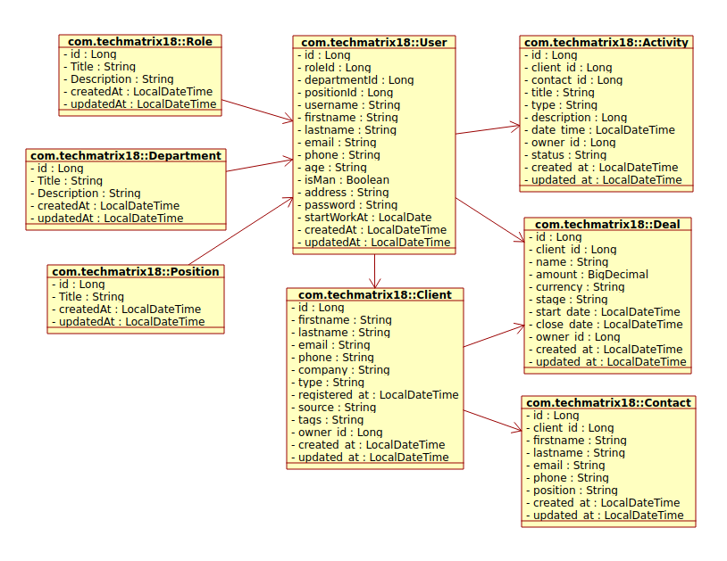
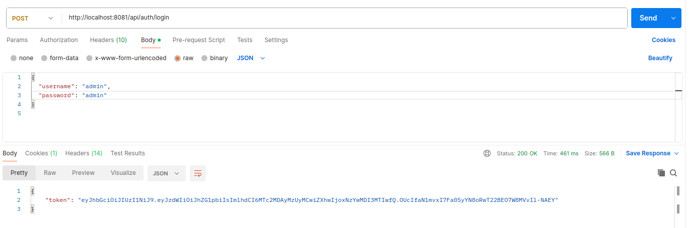
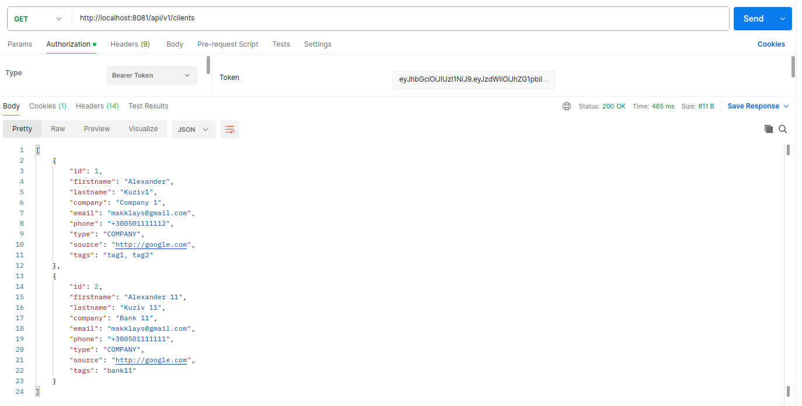
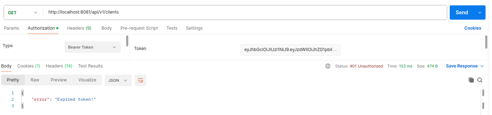

# java-flowable-workflow

This is a <b>Flowable + Java</b> demo project with sample code to demonstrate my knowledge and skills.  

Simple structure of Bank 🏦 - UML schema

    

    
    
    <!--img src="./src/main/resources/mystatic/images/1000000169.png" width="170" /-->
    
    

### Screens

    /api/auth/login (send login and password)
    
    /api/v1/clients 
    
    /api/v1/clients (jwt token expired)
     

