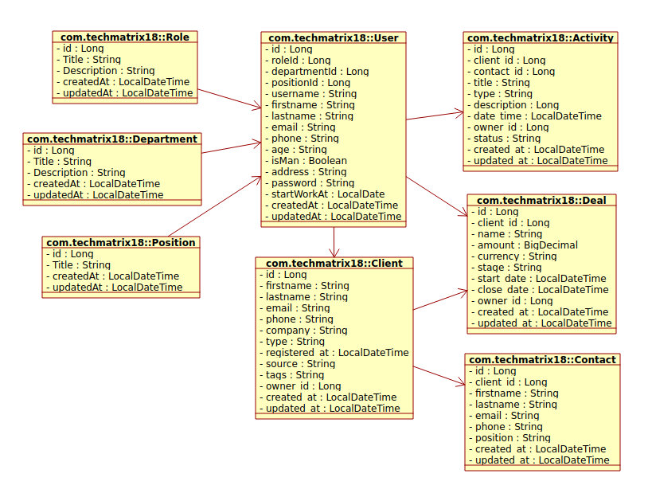
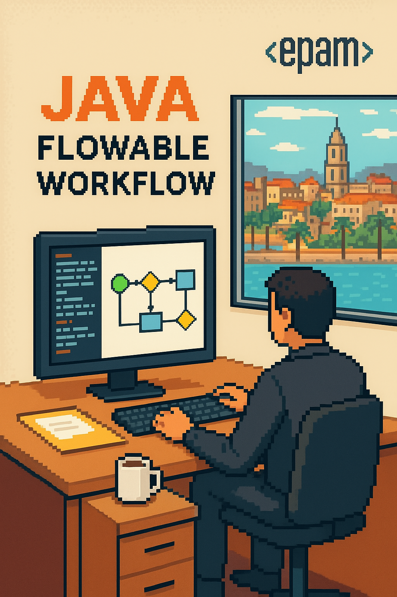

# JAVA + Flowable 

This is a <b>Flowable + Java</b> demo project with sample code to demonstrate my knowledge and skills.  

Simple structure of Bank 🏦 (UML schema)

    

    
    
    <!--img src="./src/main/resources/mystatic/images/1000000169.png" width="170" /-->
    
    

 

## Description 
This simple demo project demonstrates how I work with Flowable (dependencies on Maven + Flowable-UI from docker-compose.yml). 
This is the monolithic project on Java (with Spring Security and login via username/password and the Thymeleaf template engine) 
and with a REST API (accessible via JWT). 

For work with Flowable I created simple CRM with several Entities and html pages with CRUD functionality to manage them.
After that, I started working with Flowable and creating different BPMN process (like application for user, example: 
'Job application', 'Leave application', etc.). I came up with the forms myself and figured out how they could be 
added to the CRM.

I want to extend the project with multiple BPMN, CMMN, and DML processes, as well as their combinations, to demonstrate my expertise in working with them.
In the future, I’d like to expand the project with new entities, possibly up to an ERP system.

I enjoy working with it.

Below you can see a few screenshots from the project. 

## Screens

### CRM

    /login (by login and password)
    
    Page with BPNM, CMMN processes  
    
    Page with Departments 
    

### Flowable UI 
Flowable UI from docker-compose.yml 

    Flowable UI
    
    Add BPMN process
    
    BPMN process
    

### REST API 
accessible via JWT

    /api/auth/login (send login and password)
    
    /api/v1/clients 
    
    /api/v1/clients (jwt token expired)
     

