# JAVA + Flowable 

This is a **Flowable + Java** demo project with sample code to demonstrate my knowledge and skills.  

Simple structure of Bank 🏦 (UML schema)

    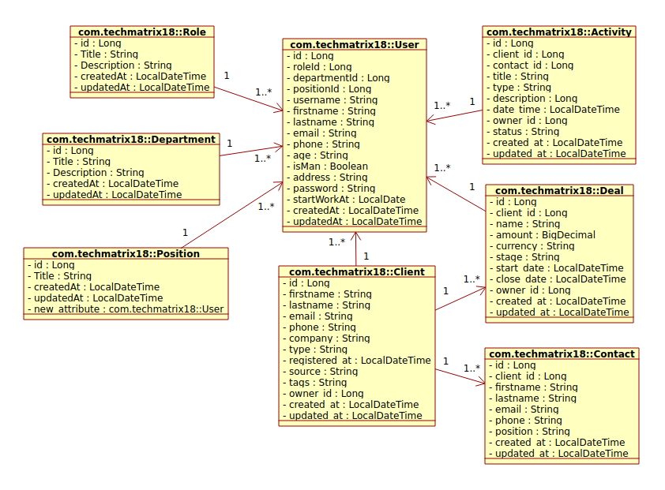

    
    

 

## Description 
This simple demo project demonstrates how I work with **Flowable** (dependencies on Maven + Flowable-UI from docker-compose.yml). 
This is the monolithic project on **Java** (with **Spring Security** and login via username/password and React on the frontend / 
the Thymeleaf template engine) and with a **REST API** (accessible via **JWT**). 
I have added a directory 'frontend' with **React** and created frontend on **React** for this project. 

For work with **Flowable** I created simple **CRM** with several Entities and html pages with CRUD functionality to manage them.
After that, I started working with **Flowable** and creating different **BPMN process** (like application for user, example: 
'Job application', 'Leave application', etc.). I came up with the forms myself and figured out how they could be 
added to the CRM. 

I have connected and added monitoring of metrics from a Spring Boot project in Grafana and Prometheus.

I want to extend the project with multiple **BPMN, CMMN,** and **DML processes**, as well as their combinations, to demonstrate my expertise in working with them.
In the future, I’d like to expand the project with new entities, possibly up to an **ERP system**.

I enjoy working with it.

Below you can see a few screenshots from the project. 

## Screens
### CRM
login (by login and password)
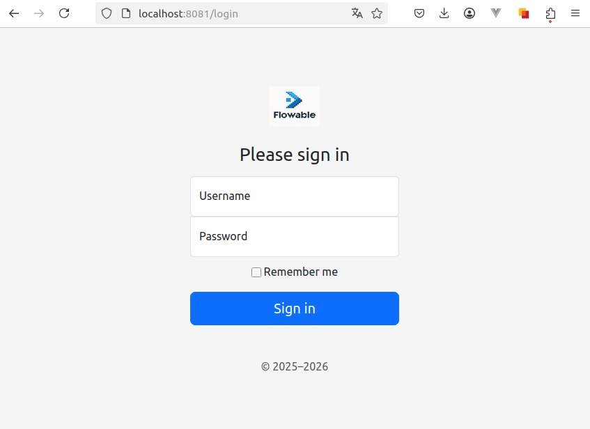

Page with **BPNM, CMMN processes** of Bank  
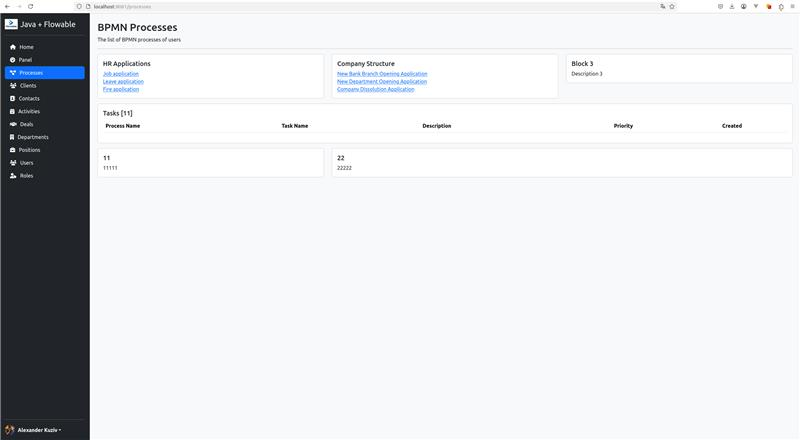

Page with Departments of Bank 
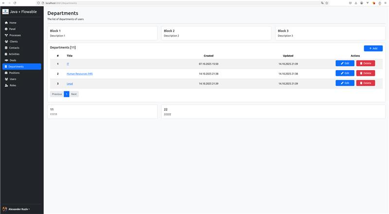

### Flowable UI 
Flowable UI from docker-compose.yml 

Flowable UI
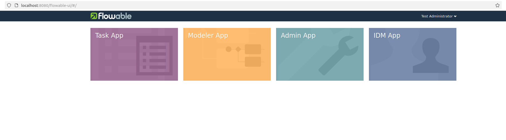

Add BPMN process
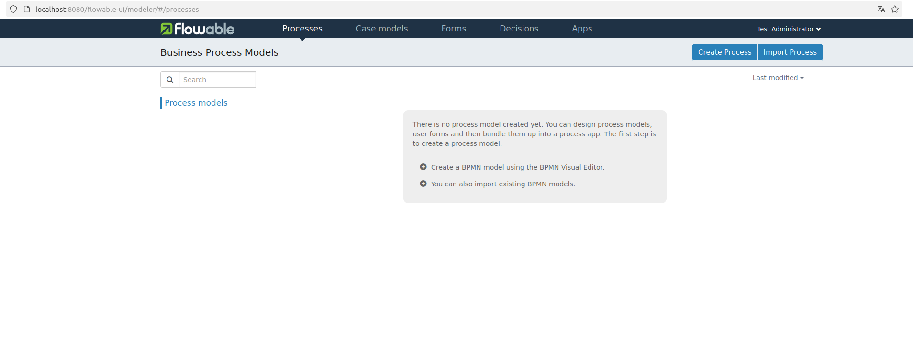

BPMN process
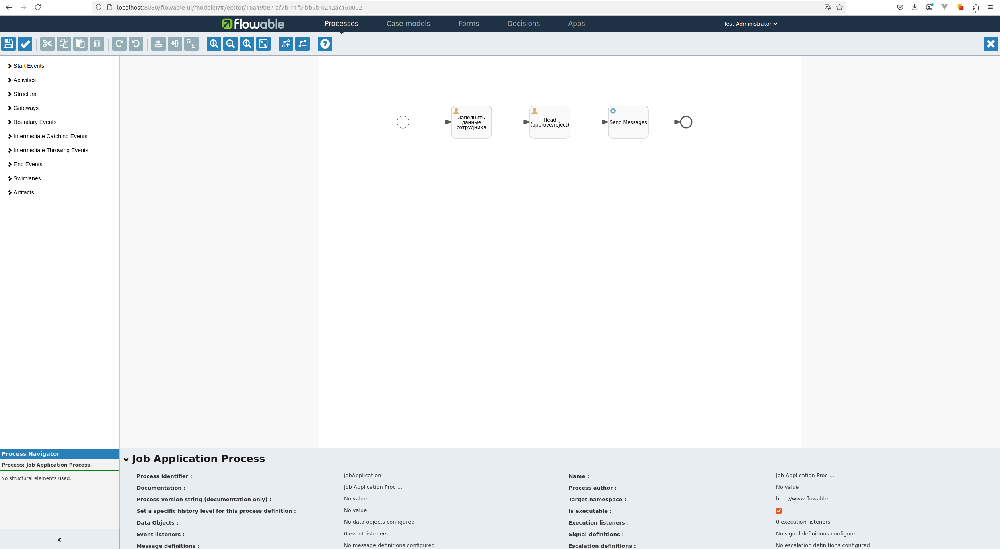

### REST API 
accessible via **JWT**

/api/auth/login (send login and password)
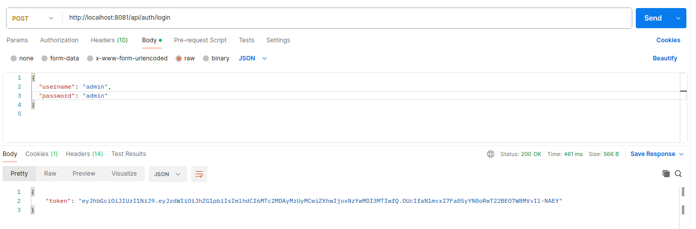

/api/v1/clients 
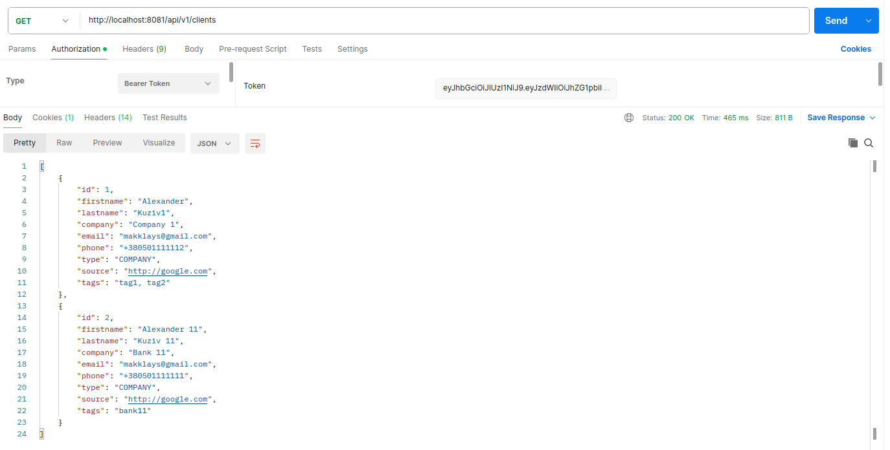

/api/v1/clients (**jwt** token expired)
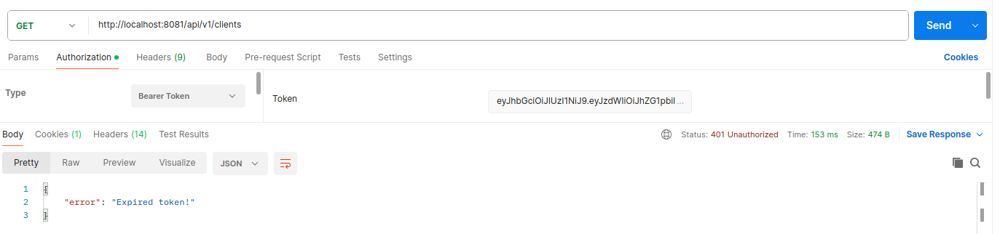 

### Prometheus + Grafana
All metrics are collected via **Prometheus** and displayed in **Grafana** dashboards

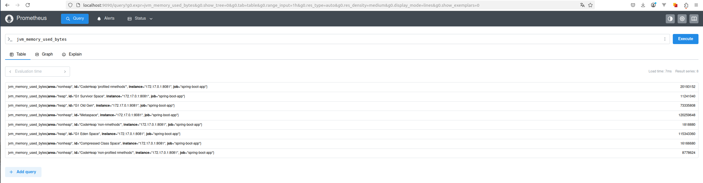

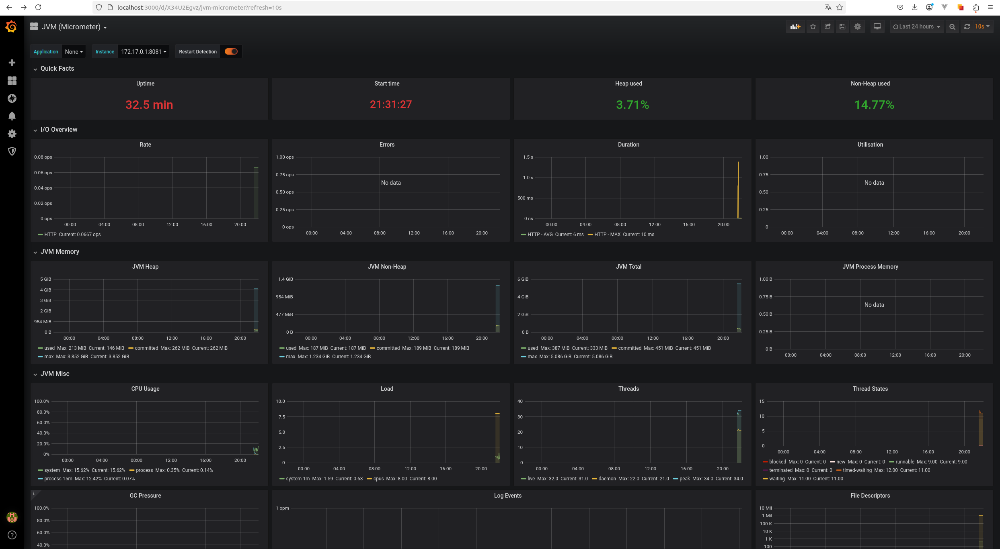

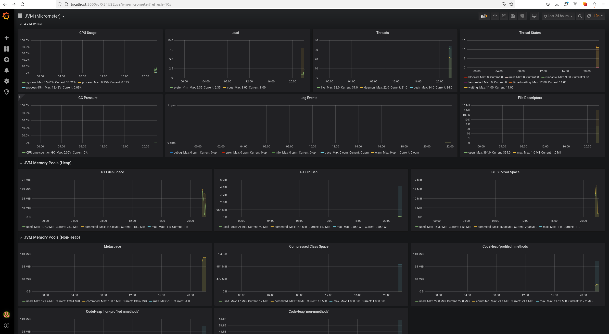

